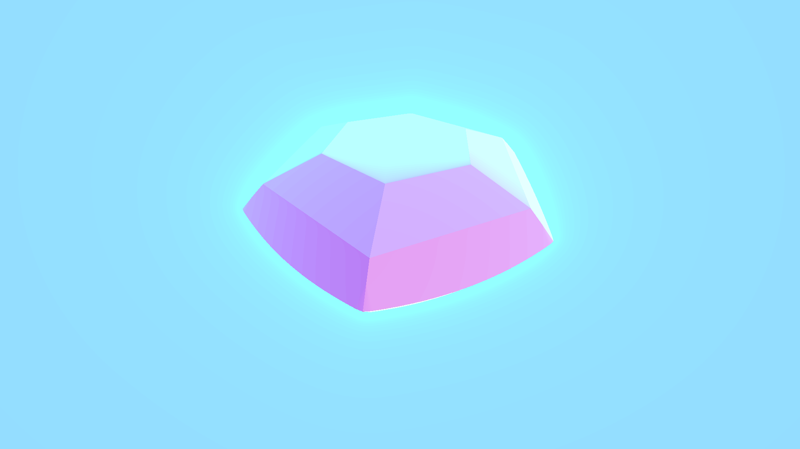

## Error : `rapidjson internal assertion failure: IsObject()`

This means that one of your parameters isn't specified in valid JSON: maybe you are missing a `,`, a `}`, or you have a `,` after the last value of your parameter? It might also be that floats need to have a decimal part: `0.` is not valid but `0.0` is.

## Parameter name

You can put spaces and `-` in the names of your parameters; just know that you have to replace them with an `_` when using your parameter in your function body. For example if you have this parameter:
```json
float {
    "Name": "fresnel strenght",
    "Default": 1.0,
    "Min": 0.0,
    "Max": 10.0
}
```

then it will be used as `fresnel_strenght`:
```glsl
[] (RayMarchRes res) {
    float fresnel = pow(clamp(1. - dot(res.normal, -res.rd), 0., 1.), fresnel_strength);
    finalCol += fresnel * fresnel_color;
}
```

## Render effects types ?

At this moment there only two types of render effects, `Object` and `Always`. They aren't used at the same place so it's really important to know what affects your effect.

The `Object` render effects are applied to the object of the scene. Among them, we can find effect like fresnel or reflection.


The `Always` render effects always applies no matter if the ray touches the object or not. Among them, we can find the glow.


## Parameters

The render effects can be made of various parameters. The main types used to describe them are the floats and the color.

`Float` : To set the strenght of your effect. Remenber to test multiple values to determine the ideal min_value and max_value.

`Color` : To set the color of your effect. Give it the default value {1.,1.,1.}.

```json
float {
    "Name": "your_effect_strenght",
    "Default": 1.0,
    "Min": 0.0,
    "Max": 10.0
}
```

```json
color {
    "Name": "your_effect_color",
    "Default": {
        "x": 1.0,
        "y": 1.0,
        "z": 1.0
    }
}
```

## Res ?

If you look at the files already present in the Objects and World's directories, you will notice that the functions have an input called `RayMarchRes res`. This input is a structure that allow the retrieval of various information essential to the render effects creation.

```c++
struct RayMarchRes {
    float dist;
    int iterations_count;
    vec3 rd;
    vec3 hit_position;
    vec3 normal;
};
```

`dist` : Distance between the rayon's origin and the object

`iterations_count` : Number of iteration before stoping the ray marching

`rd` : Rayon direction

`hit_position` : Position where the rayon hit the object

`normal` : Normal of the hit_position

## Create your own render effect

Before creating yout render effect file, you have to ask yourself what type of effect you want to create. Will it be an `Object` effect, a `Always` one or a new one. Then you can create the file in the correct folder if it already exist else create the new folder.

If you don't know how to start, take a look at the files already here. Then create your effect in the function body and remenber that if you want to use modular parameters declare them below the function body.

If you want to create a function and use it in the function body you can do it at the top of the file. Put two \` \` and then create your function.