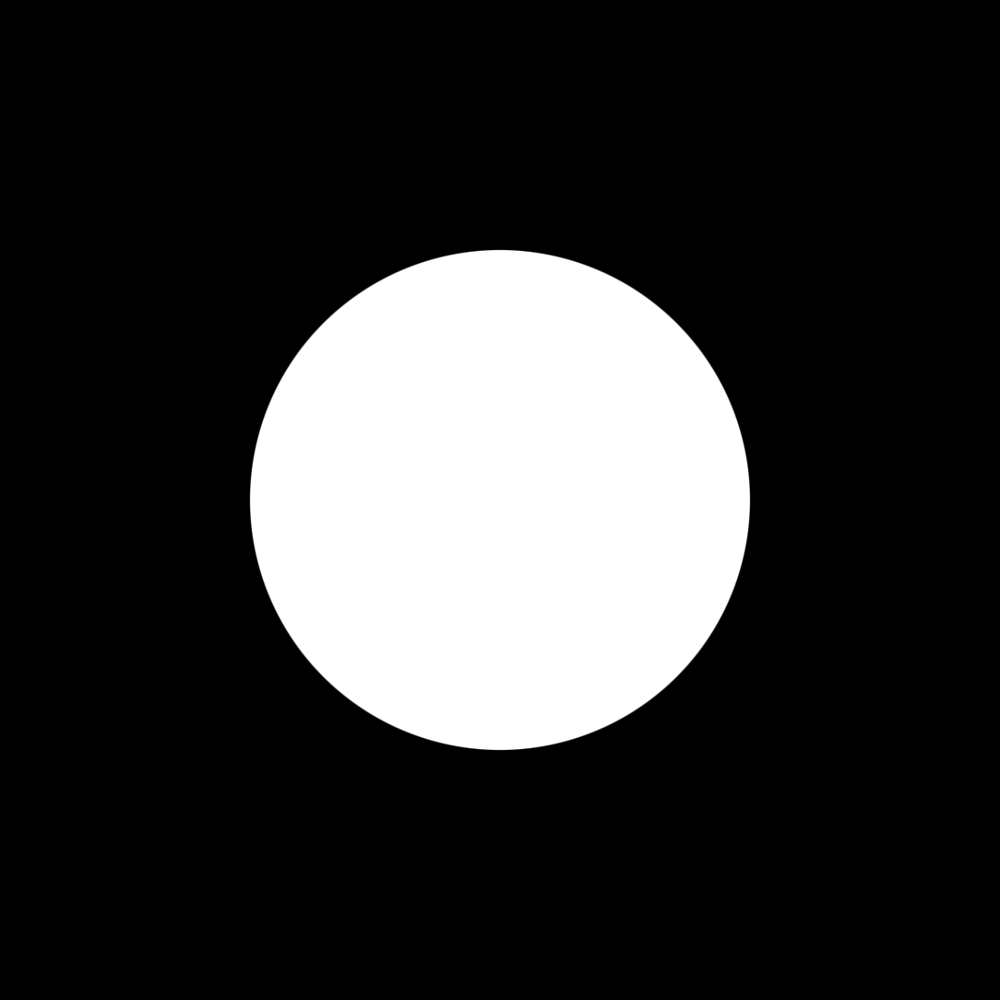
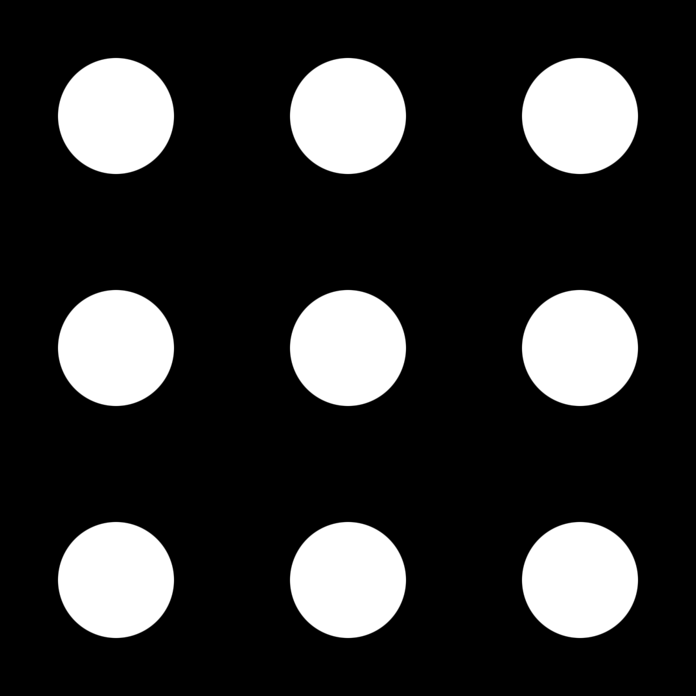
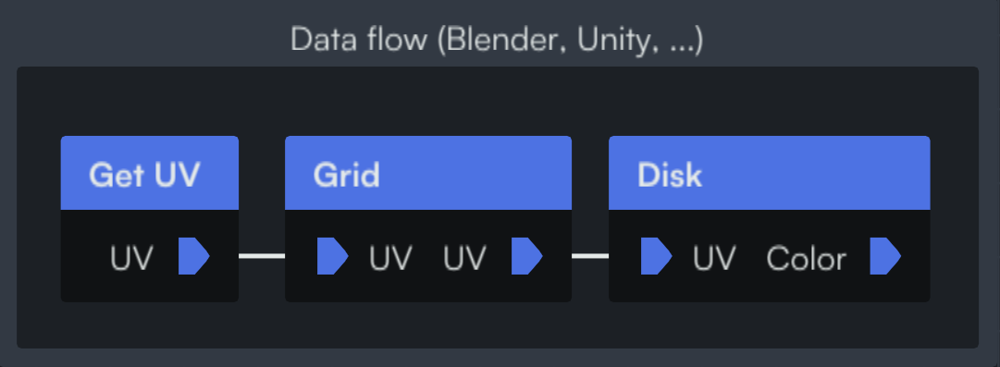
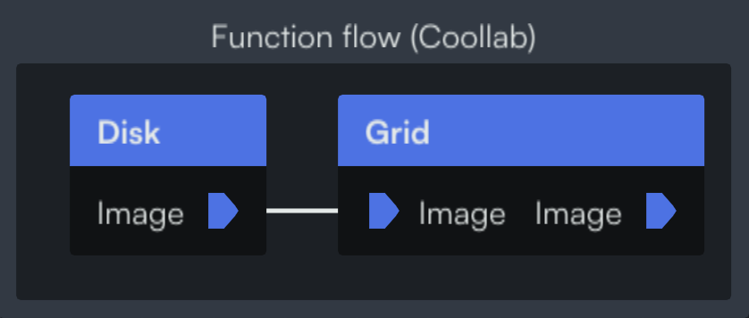
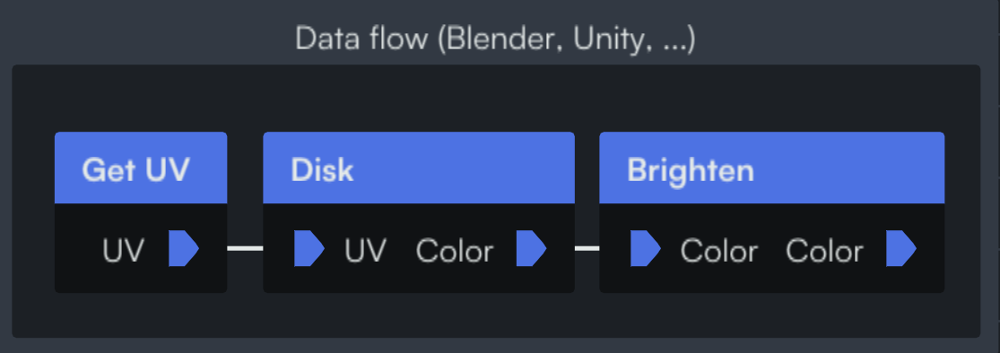
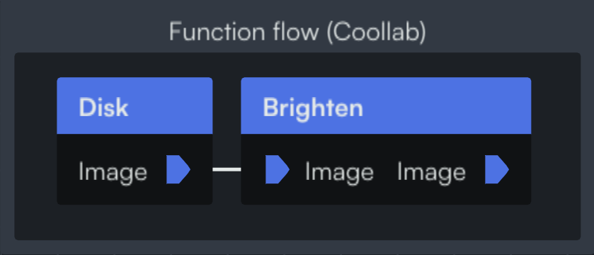

# Simplifying node-based programming with a functional approach

Coollab is a node-based generative-art software where you compose small building blocks to create abstract artworks. It shares a few similarities with TouchDesigner, NotchVFX and the likes. But unlike any other software that we are aware of, Coollab takes a much higher-level approach with its nodes, inspired by functional programming. The main design guideline of Coollab is to have a very low barrier to entry, and make shader-art techniques accessible even to people with little to no knowledge in programming or mathematics.
In this article we present our approach to generating shaders from nodes, where links between nodes do not represent passing data around, but passing functions. This allows us to create higher-level nodes and offer a more declarative and intuitive workflow to the users.

## What is Coollab?

Here is an example of an artwork made with Coollab:


As you can see, the graph is very declarative: you start with a shape (`Disk`) and then apply several effects on top of it (`Kaleidoscope`, `Zoom`, etc.).

What allows us to be that declarative is that we do not pass *data* between nodes, but *functions*. Each node receives a function (the previous node) and decides when to call it, with which parameters, and what to do with the output. This allows us to have more freedom when implementing nodes, and abstract more details away from the user.

We will come back to what this *function vs data* means, but first you need to understand the basics of what Coollab builds upon: shader art.

## Intro to shaders

If you are not familiar with shader art you can watch this great video: [An introduction to Shader Art Coding, *by kishimisu*](https://youtu.be/f4s1h2YETNY). But in essence the only thing you need to know is that we want to write some code that will be run for each pixel of our canvas, and will compute a color based solely on the position (called UV) of the current pixel. For example, here is how you would draw a Disk:
```glsl title="Disk"
function Disk(uv: UV) -> Color
{
    if(distance(uv, vec2(0, 0)) < 1) // If the pixel is inside the disk (distance from the origin less than 1)
        return vec3(1.);             // Then color the pixel white
    else
        return vec3(0.);             // Otherwise color it black
}
```
After that function has been run on all the pixels, some of them will have been colored white, others black, and overall they will form a white disk on a black background.

<!--  -->

<div style={{width: "30%", margin: "auto"}}>



</div>


In Coollab, users don't need to write code (although advanced users can), they can use the nodes that we provide: they wrap-up common operations you might want to do in code, and Coollab generates the shader code under the hood based on the nodes and links you created.

## Function-flow vs Data-flow

Let's take the example of a grid of disks:

<div style={{width: "30%", margin: "auto"}}>



</div>

The way to do this using a shader is to first write a function that draws a disk, and then modify its input to make it tile over space by using the `fract` function (cf. https://youtu.be/svLzmFuSBhk?t=235, where `mod(x, 1)` is equivalent to `fract(x)`).

So a data-oriented workflow like we can find in Blender's Shader Nodes or Unity's Shader Graph would look like this: we first get the position (UV), then modify it with a Grid node, then pass it to the Disk node.



And the implementation of the nodes would look something like this:

```glsl title="Get UV"
function GetUV() -> UV
{
    return uniform_uv; // Global variable accessible to the shader
}
```
```glsl title="Grid"
function Grid(uv: UV) -> UV
{
    return fract(uv); // Modify the UV
}
```
```glsl title="Disk"
function Disk(uv: UV) -> Color
{
    if(distance(uv, vec2(0, 0)) < 1)
        return vec3(1.); // Color the pixel white
    else
        return vec3(0.); // Color the pixel black
}
```

On the other hand, in Coollab you first create your Disk node, and then pass that *function* to the Grid node, which will call it with a modified UV. Note that here the pins of the nodes don't represent UVs or Colors, but *Images* (i.e. functions from UV to Color).


The Disk node is the same:
```glsl title="Disk"
function Disk(uv: UV) -> Color
{
    if(distance(uv, vec2(0, 0)) < 1)
        return vec3(1.); // Color the pixel white
    else
        return vec3(0.); // Color the pixel black
}
```
but the Grid is now an Image too, that takes another Image as input:
```glsl title="Grid"
INPUT function Image: UV -> Color; // Declare an input pin on the node, that will receive a function called Image.

function Grid(uv: UV) -> Color
{
    return Image(fract(uv)); // Use the "Image" function with a modified input (UV).
}
```
*NB: this implementation of the Grid might seem more cumbersome to write than the data-flow one, but actually in Coollab we can generate this code from the simpler data-flow one, so you get the best of both worlds and writing nodes remains very easy.*

It is important to note that the order of the nodes differs: in the data-flow example you use a Grid then a Disk, whereas in the function-flow the Disk comes first.

To understand why the function-flow approach can be more intuitive, let's consider another effect, this time modifying the *Color* instead of the *UV* (i.e. the *output* of the Disk function instead of its *input*).

In a data flow this would look like this:

```glsl title="Brighten"
function Brighten(color: Color) -> Color
{
    return color * 2; // Modify the color
}
```

And in a function flow it looks like this:

```glsl title="Brighten"
INPUT function Image: UV -> Color; // Declare an input pin on the node, that will receive a function called Image.

function Brighten(uv: UV) -> Color
{
    return Image(uv) * 2; // Use the "Image" function and modify its output.
}
```

The key takeaway here is that in Coollab, all effects are placed *after* the node they apply to (we either take a Disk and repeat it in a Grid, or take a Disk and Brighten it). Whereas with a data-oriented approach some effects need to be applied *before* and others *after*! We believe this consistency makes our approach more intuitive.

And it goes even further! Some effects need to modify *both* the input and the output of the function, making them near impossible to implement with a single node in a data-oriented workflow. For example, a common technique in shader programming is to build *fractal noise*[^1] from a *base noise* function, by layering it several times on top of itself at different scales:


[^1]: https://thebookofshaders.com/13/

In a data-oriented workflow it is not possible to provide the base noise function as an input to the fractal noise function, and so you will generally see the base function hardcoded in the node. But in Coollab we can give users the freedom to provide the base noise function they want! This led to some pleasant surprises when people started using photos as a "base noise", turning the fractal noise effect into an interesting way to add "glitch" to images.


*Coollab's logo (left) and Coollab's logo with the fractal noise effect applied (right)*

```glsl title="Fractal Noise"
INPUT function Noise: UV -> Color;

function main(uv: UV) -> Color
{
    float value = 0;
    float amplitude = 1;

    for (int i = 0; i < 6; i++)
    {
        value += amplitude * Noise(uv);
        uv *= 2;
        amplitude *= 0.5;
    }
    return value;
}
```
*Coollab's fractal noise function, that uses the input "Noise" function in a way that cannot be emulated with a single node in a data-oriented workflow.*

## Conclusion

This approach works very well to describe image-generation patterns in shaders, but we are unsure how well it could be applied to other areas. We are planning on implementing a particle system based on the same principles to see how well they can be applied there. Even though we are not convinced the benefits will be as clear, we think this is an avenue worth exploring, and we believe our approach should be considered as a possibility whenever designing any node-based system.

If you want to download Coollab and try it for yourself, the software is free and open-source: https://linktr.ee/coollab_art.
