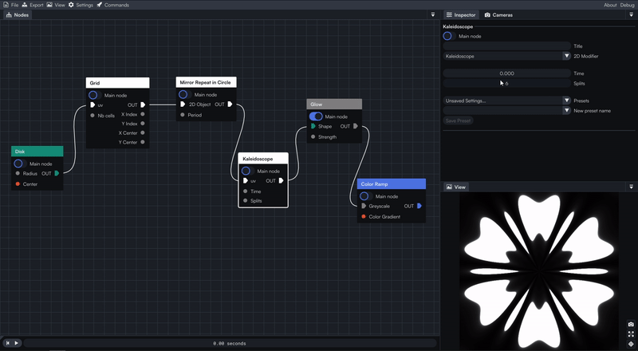
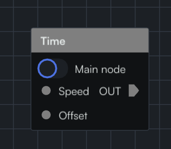
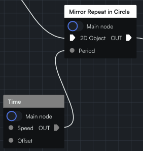
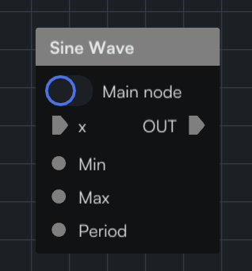
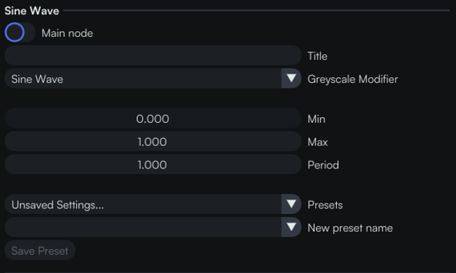
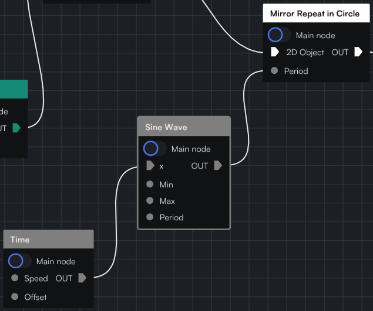
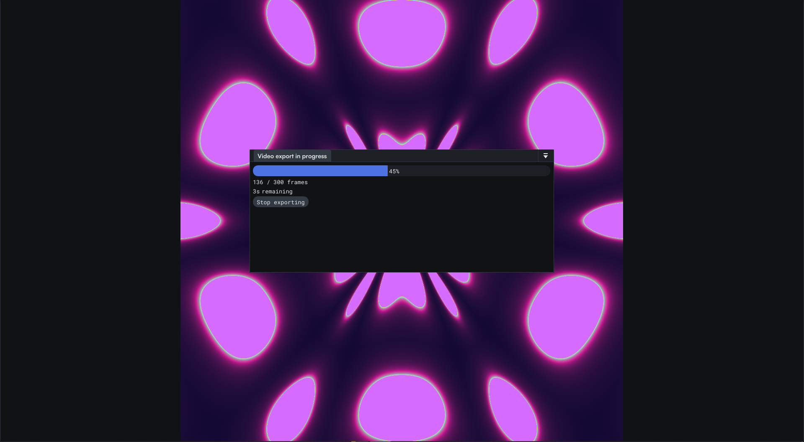
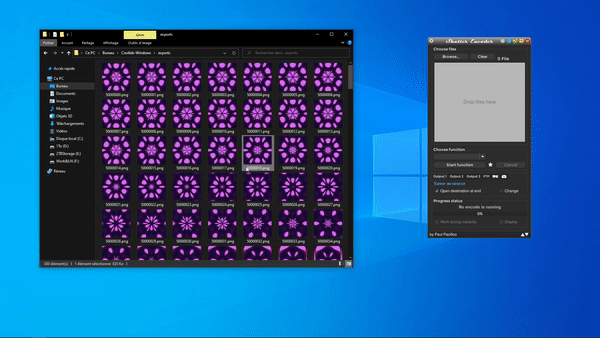
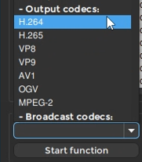
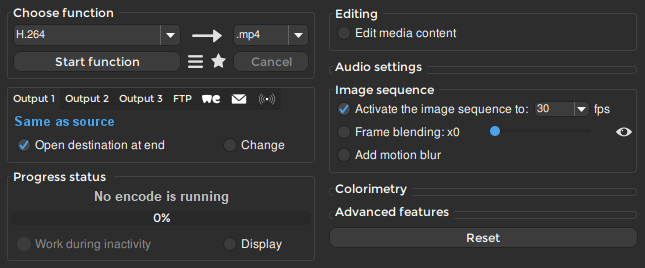

## Summary

Today we are going to see how to use the `Time` node in order to have an animated artwork.

This is how we will progress: 

- Starting from an artwork
- How to use the `Time` node
- Export the artwork as a video

Let’s get started!

## Starting from an artwork

We will use the artwork from the [previous tutorial](03-A-simple-example.md).

You probably noticed that sometimes, when you change a parameter, it has a direct impact on the image in the view panel. In a slider for example, we can see the image changing as we drag the value.

So why not create an animation for this parameter? 
This is where the `Time` node comes into play!

## How to use the **`Time`** node

You can use it to animate a property of a node.

In our case we will play with the `Mirror Repeat in Circle` node that we added. 
Let’s link a `Time` node to its `Period` parameter.

In the timeline, you can press play to start the animation. The value of the parameter linked to the `Time` node will increase over time.

Within the time node, you have two parameters.

`Speed`: You can control the speed of the animation. 
`Offset`: You can select an offset, to make sure a time of **0** corresponds to the moment you want in the animation.

We will set both the `Speed` and the `Offset` to **1**. We use an `Offset` of **1** because we want our smallest period to be **1**, not **0**. Let’s see what this does if we press **Play** now.

If you want a back and forth movement, you can apply the `Sine Wave` node onto the `Time` for example.

  

This node has three parameters: 
`Min` and `Max` control how small and big the value will get. 
`Period` is the time it takes to complete a full cycle (in seconds). 
A cycle starts at the `Min` value, goes all the way up to the `Max` value, and then back to the `Min` value.

Put this node between the `Time` and `Mirror Repeat in Circle` nodes. We can set the `Min` to 1, the `Max` to 4 and the `Period` to 5.

We have this amazing result!

:::info Did you know?
You can input your own expression for a function using the `Math Expression` node.
:::

:::note Maps & masks
You can also use maps and/or masks to change a property over space instead of time.
:::

## Export the artwork as a video

When we are happy with the animation, we can go over to the  export section. In the drop down menu, click on the  `Video` option.

As for the image in the previous tutorial, we can choose the resolution and the aspect ratio as well as the path where we want to save our frames. You can change the framerate and the length of the animation, either in seconds or in frames.

Now that you have all the frames, you can create your own sequence using the software of your choice (<i>Premiere</i>, <i>After Effect</i>, <i>Shutter Encoder</i>, …) and export it to a video! 
We will take the example of [**Shutter Encoder**](https://www.shutterencoder.com/en/), it is free and easy to use! 
Once you have it downloaded, open it and proceed as follows:

- Drag and drop all your images in the appropriated area

- Under the `Choose function` menu, choose an **Output codec** (H.264 in our example)

- Ensure that the image sequence is set at the correct framerate under the `Image sequence` section.

In our case, we selected 30 fps because this is what we used when exporting in Coollab.

You can change the destination at your convenience, we will stick with the destination from the sources files.

- Now click on `Start function`, wait for the export to finish and you will obtain the video!

Here are some others animated examples!

               

## End of the tutorial

This the end of this tutorial. It is now your turn to experiment with the `Time` node to animate your artworks.

Feel free to modify the example we have done together, play with different nodes’ parameters, add multiple `Time` nodes and admire the result! 😃

See you in another tutorial of the Coollab discovery series! 👋
