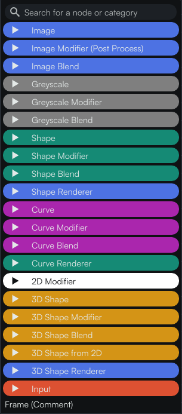
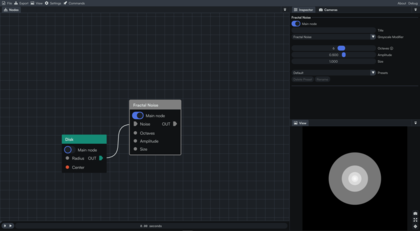
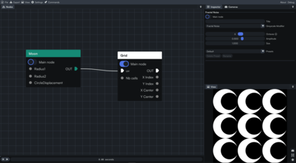
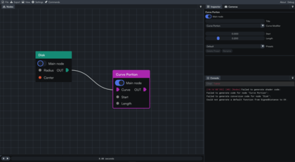
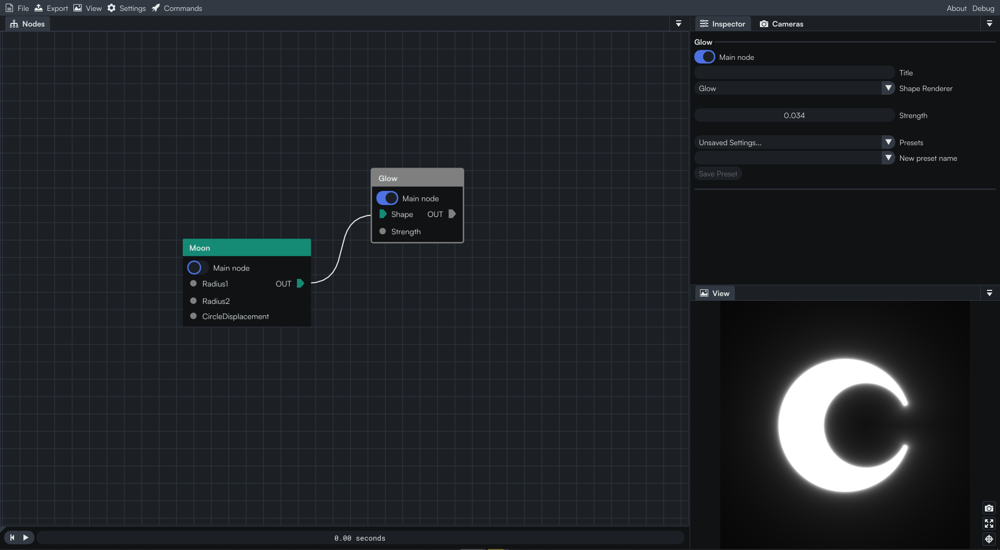
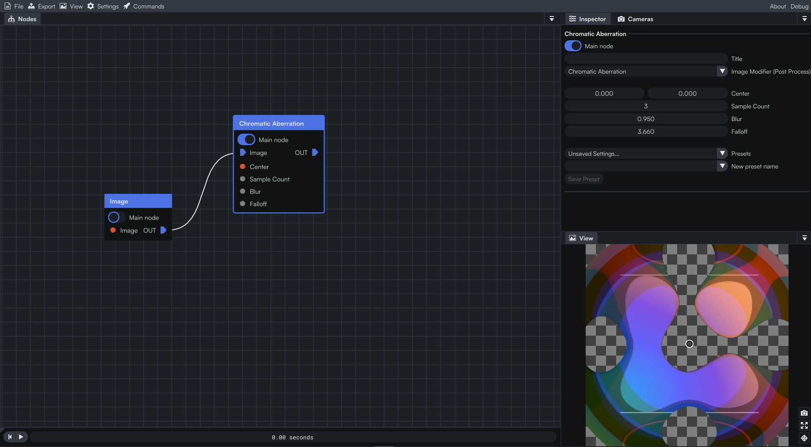
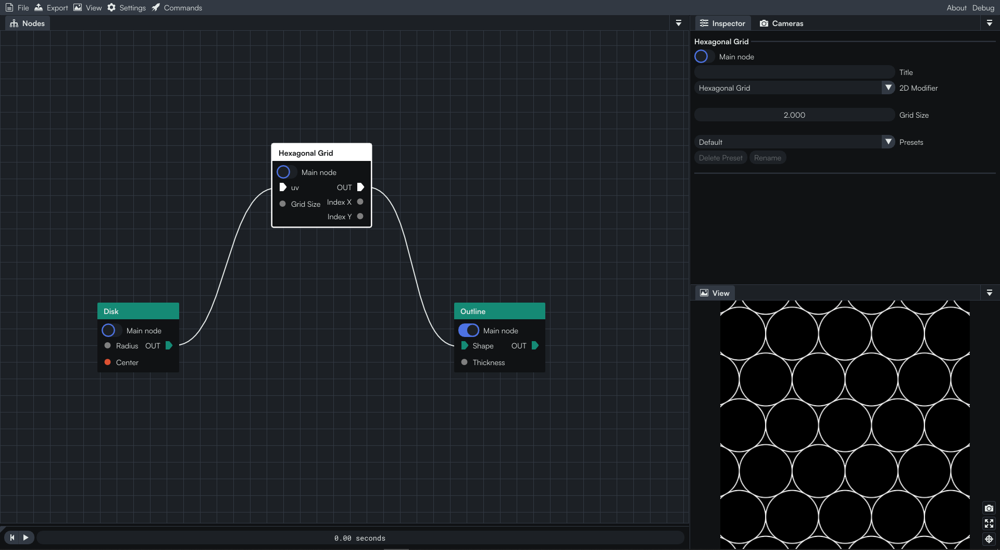
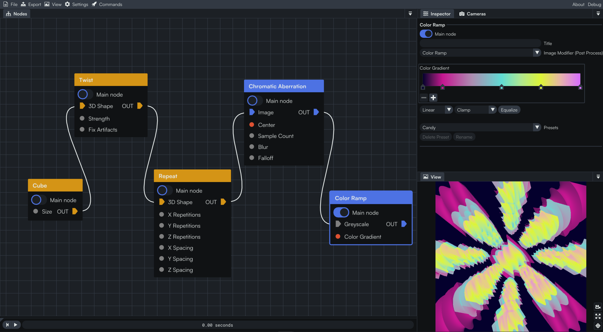
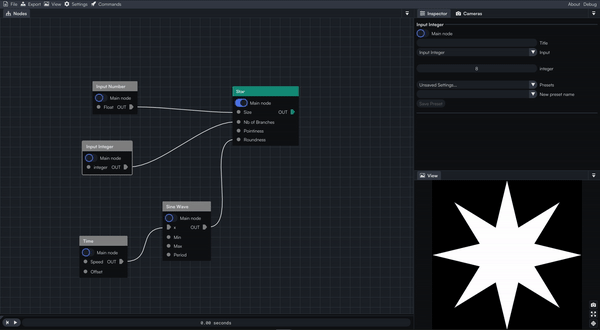

import YoutubeVideo from "@site/src/components/YoutubeVideo"

<YoutubeVideo id="IlZ9_itjPPs"/>
 

Today we will see an overview of the different kinds of nodes in Coollab.

You probably noticed that we have differents colors in the nodes dropdown menu. That’s not a coincidence.

The purpose of this tutorial is to familiarize the user with the compatibility between the various nodes. Furthermore, it will allow the user to discover and play with new types of nodes.

The tutorial is structured as follows: 

- Nodes compatibility
- Curves
- Shapes
- Images / Greyscales
- 2D Modifiers
- 3D Shapes
- Miscellaneous

Without further ado, let’s get started!

## Nodes compatibility

It is good to know that Coollab adopted a color scheme for its nodes. As you can see in the nodes menu, each category of nodes has a respective color (i.e. green for `Shapes`).

We can mention the fact that nodes are arranged in a certain way in this menu. In fact, there is a bottom-up order for compatibility, starting from curves nodes. If we take a `Curve`, we can link it to an input pin of the above types (i.e. to a `Shape`, `Greyscale` or `Image`) and so on.

The general idea is represented with the simple scheme below.

Let’s take an example: 

If we start with a `Shape` node, we can link its output to an `Image` or `Greyscale` **input**. We can also apply any `2D Modifier` as they accept any 2D node. But on the other hand, if we try to link a `Shape` to a `Curve Modifier` node, we will get an error in the console panel. Indeed a `Curve Modifer`, as the name suggests, is appropriate for curves, and a `Shape` cannot be implicitly converted to a `Curve`.

 
`Shape` → `Greyscale` ✅

 
`Shape` → `2D Modifier` ✅

 
`Shape` → `Curve Modifier` ❌

In the next sections, we will take a closer look at the different categories.

## Curves

A `Curve` can be used as an `Image` or a `Shape`, but it can also do more! Some things are specific to curves.

All the nodes related to curves are represented by a  magenta  color. They are really fun to play with. We will give you a demonstration of a disk moving along a curve.

As you can see, we were able to use the `Lemniscate` curve as a path and the `Disk` is moving along it. You can clearly notice the infinity shape of the lemniscate curve. Thanks to `Point on Curve` we extracted a point from the curve and assigned it to the `Center` of the disk. The position of this point is determined by the current time. In the end, we obtain this smooth and satisfying animation!        

It is good to know that a curve always has a length of 1, 0 being the start of the curve and 1 its end. In this other example below we made good use of this property to create a drawing animation using the curve modifier `Curve Portion`.

Here, the `Length` value varies between 0 and 1, and as a result we have the impression of drawing the Lissajou curve.

## Shapes

All the nodes related to (2D) shapes are represented by a  green  color. As is in the name you will find different shapes in this category (Disk, Rectangle, Polygon,…). They are often used as a starting point for an artwork, thus they are really popular. This category is pretty intuitive. It is important to note that, even though a `Shape` can be used as a regular `Image`, it is more powerful than that! Some effects only work on shapes and not on images. (For example the `Glow` and the `Outline`, and more generally all the `Shape Modifiers`, `Shape Blends`, and `Shape Renderers`).

Let’s take a `Shape` and attach a `Shape Renderer` node to it to see the application.

As you can see, the `Glow` (the shape renderer here), affects the whole `Shape`.

## Images / Greyscales

All the nodes related to images are represented by a  blue  color.  
In the same way,  grey  is used for `Greyscale` nodes. These nodes are mostly used to add various effects to our artworks thanks to the `Modifier` and `Blend` nodes ✨.

Here we used the node `Image` which allows us to import an image of our choice. We applied an `Image Modifier` on it called `Chromatic Aberration`.

Basically `Image` and `Greyscale` nodes work the same, the only difference lies in the color. If you link an `Image` to a `Greyscale` input, you will end up losing the color.

## 2D Modifiers

All the nodes related to 2D Modifiers are represented by a **white** color. These modifiers can be used on any 2D node (`Curves`, `Shapes` and `Images` / `Greyscale`). We have seen some in previous tutorials like the `Mirror Repeat in Circle` or `Kaleidoscope`. They generate amazing effects and are therefore very useful to create unique artworks. Note that the output of a `2D Modifier` is of the same kind as the node it is linked to. For example if you input a `Shape` then its output will be a shape too.

` Shape` → `2D Modifier` → `Shape Modifier` ✅

## 3D Shapes

All the nodes related to 3D shapes are represented by a  yellow  color. Similarly to the `Shape` nodes you will find different shapes here but this time in 3D (`Cube`, `Sphere`, `Torus`,…). When you are working with 3D shapes you can change the type of the camera to inspect the shape. 

If you keep the  `2D camera` you can only move the shape on the X and Y axes. 
The  `3D camera` allows you to move along the Z axis as well.

You can add several modifiers for various results 🧊! Here we twisted our cube then repeated it three times along each axis to obtain these marshmallows!

If you remember the **Nodes Compatibility** scheme, it is possible to link a `3D Shape` to an `Image` input. Let’s add the great `Chromatic Aberration` and a `Color Ramp`.

## Miscellaneous

All the `Miscellaneous` nodes are represented by an  orange  color.

This category serves as a catch-all. 

You can find different inputs for the most part (2D vector, Integer, Number,…). This is also where we can find the `Time` node used for animation!

 
Here, the `Size` of our `Star` and its number of branches are controlled by values we input thanks to `Input Number` and `Input Integer`. Similarly, the time influences its `Roundness`.

## End of the tutorial

And this is the end of the last tutorial in the Coollab Discovery series

We hope that this overview of the different nodes categories helped you understand them and how they were handled inside Coollab. 
Now that you discovered several types of nodes, feel free to use them in your projects to create even more diversity in them! 🌟 

See you later in another Coollab tutorials series! 👀

