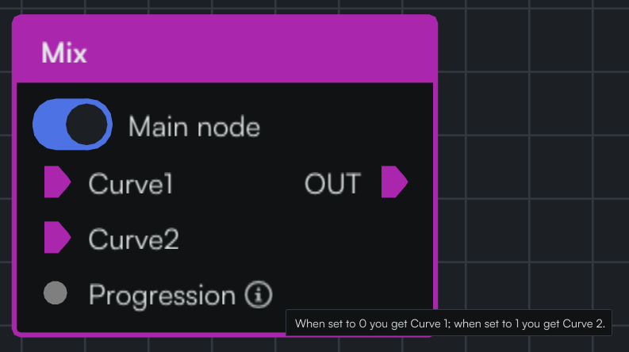

## Input values

Each node can have parameters that will appear as GUI widgets on the node. You declare them using the `INPUT` keyword and their name must start and end with a single quote (`'`) (This allows their names to include spaces and any other funny character).

```glsl title="Circle (Mask)"
INPUT float 'Radius';
INPUT float 'Edge blur';
INPUT UV    'Center';

float main(UV uv)
{
    float d = length(uv - 'Center');
    return smoothstep('Edge blur', 0., d - 'Radius');
}
```

Here are all the types you can have as a value input:
- `bool`
- `int`
- `float`
- `Point2D` (`vec2` under the hood. Unlike `vec2`, this will create a point on the screen that you can move around)
- `vec2`
- `vec3`
- `vec4`
- `Angle` (`float` under the hood)
- `Direction2D` (`vec2` under the hood, guaranteed to be of length 1)
- `Hue` (`float` under the hood, guaranteed to be between 0 and 1).
- Color (`Oklab`, `sRGB`, `LinearRGB` or `Okhsl`). See the [Color Spaces section](40-Color%20Spaces.md) to learn all about the various color types. (`vec3` under the hood).
- Color and alpha (`Oklab_PremultipliedA`, `Oklab_StraightA`, `LinearRGB_PremultipliedA`, `LinearRGB_StraightA`, `sRGB_PremultipliedA`, `sRGB_StraightA`, `Okhsl_PremultipliedA` or `Okhsl_StraightA`). See the [Color Spaces section](40-Color%20Spaces.md) to learn all about the various color types. (`vec4` under the hood).

## Input functions

Nodes can also take functions (a.k.a. other nodes) as inputs. You also declare them with the `INPUT` keyword and put their name inside single quotes ('). Then to use them you just call them as regular functions.

```glsl title="RGB Split"
INPUT UV->sRGB_StraightA 'Image'; // This INPUT is a function.
                                  // You can see that with the ->
                                  // that separates its input (UV)
                                  // from its output (sRGB_StraightA).
INPUT float 'Displacement';
INPUT Direction2D 'Direction';

sRGB_StraightA main(UV uv)
{
    vec4 R = 'Image'(uv + 'Displacement' * 'Direction');
    vec4 G = 'Image'(uv);
    vec4 B = 'Image'(uv - 'Displacement' * 'Direction');

    return vec4(
        R.r,
        G.g,
        B.b,
        max(max(R.a, G.a), B.a)
    );
}
```

To declare a function that takes multiple inputs, here is the syntax:
```glsl
INPUT (Oklab_PremultipliedA, Oklab_PremultipliedA)->Oklab_PremultipliedA 'Blend Mode';
```

All the possible types for function inputs are the same as for the `main` function (see the [Primitive Types section](10-Primitive%20types.md)).

## Descriptions

You can add a description to your inputs, by using a comment with **3 slashes (`///`)** :

```glsl
INPUT float 'Progression'; /// When set to 0 you get Curve 1; when set to 1 you get Curve 2.
```

This will add a "<span class="icon-info"></span>" next to the pin, that will show your description when hovered.
